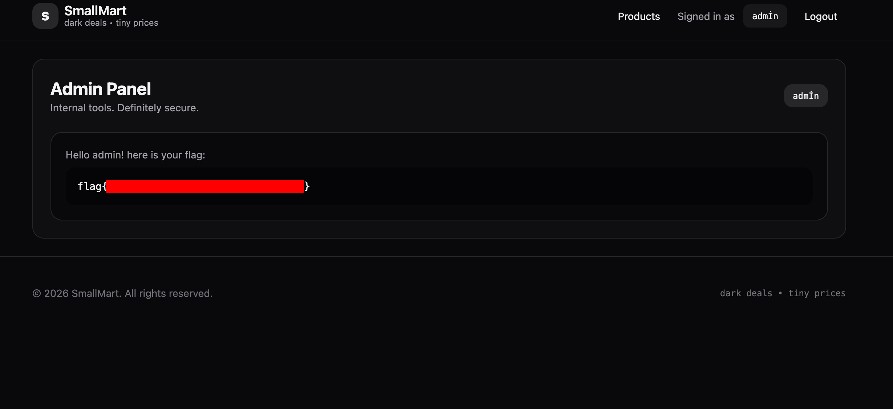

[← Back](./)

# HackingHub - SmallMart Lab Writeup

<div class="meta">
  <span><strong>Date:</strong> 2026-02-13</span>
  <span><strong>Difficulty:</strong> Advanced</span>
  <span><strong>Platform:</strong> HackingHub</span>
</div>

---

## Executive Summary

**Overall Risk Rating:** 🔴 Critical

**Key Findings:**
- 1 Critical Unicode case mapping inconsistency enabling admin access bypass (CWE-178)
- 1 High identity-based access control using username instead of role (CWE-863)
- 1 High plaintext password storage (CWE-256)
- 1 Medium default Flask secret key in source (CWE-798)

**Business Impact:** Exploiting the difference between Python's `str.lower()` and `re.IGNORECASE` Unicode handling allows an attacker to register a username that bypasses admin restrictions and gain full admin panel access.

---

## Objective

Identify and exploit a vulnerability in the SmallMart application by reviewing the provided source code. Gain access to the admin panel and retrieve the flag.

## Initial Access

```bash
# Target Application
URL: https://smallmart.hackinghub.io

# Auth: Flask session cookie
Cookie: session=<flask-signed-cookie>
```

## Key Findings

### Critical & High-Risk Vulnerabilities

1. **Unicode Case Mapping Inconsistency** - `str.lower()` and `re.IGNORECASE` use different Unicode folding rules (CWE-178)
2. **Identity-Based Access Control** - Admin check relies on username string matching rather than role-based authorization (CWE-863)
3. **Plaintext Password Storage** - Passwords stored and compared without hashing (CWE-256)
4. **Default Secret Key** - Flask secret key falls back to hardcoded value in source (CWE-798)

**CVSS v3.1 Score for Unicode Bypass:** **8.6 (High)**

| Metric | Value |
|--------|-------|
| Attack Vector | Network (AV:N) |
| Attack Complexity | Low (AC:L) |
| Privileges Required | None (PR:N) |
| User Interaction | None (UI:N) |
| Scope | Changed (S:C) |
| Confidentiality | High (C:H) |
| Integrity | None (I:N) |
| Availability | None (A:N) |

## Enumeration Summary

### Application Analysis

**Target Endpoints Discovered:**

| Component | Path | Description |
|-----------|------|-------------|
| Store | `/` | Product listing (15 items) |
| Register | `/register` | User registration with admin username block |
| Login | `/login` | Authentication with admin account lockout |
| Admin Panel | `/admin` | Flag display, requires `is_admin_username()` check |

**Summary:**
- **Framework:** Flask with Jinja2 templating
- **Database:** SQLite
- **Authentication:** Flask session cookies (server-signed)
- **Authorization:** Username-based (not role-based)

## Attack Chain Visualization

```
┌─────────────────────┐     ┌──────────────────┐     ┌─────────────────────┐
│  Source Code Review │────▶│   Identify Check │────▶│   Find Unicode Char │
│  Spot 3 different   │     │   Inconsistency  │     │   İ (U+0130) where  │
│  admin checks       │     │   lower() vs re  │     │   lower()≠re.IGNORE │
└─────────────────────┘     └──────────────────┘     └─────────────────────┘
                                                                │
                                                                ▼
┌─────────────────────┐     ┌──────────────────┐     ┌─────────────────────┐
│   Access /admin     │◀────│   Login as admİn │◀────│   Register admİn    │
│   Flag Retrieved    │     │   Bypasses lock  │     │   Bypasses lower()  │
│                     │     │   row != "admin" │     │   check             │
└─────────────────────┘     └──────────────────┘     └─────────────────────┘
```

**Attack Path Summary:**
1. **Source Code Review:** Identify three inconsistent admin username checks
2. **Unicode Analysis:** Find İ (U+0130) which maps differently under `lower()` vs `re.IGNORECASE`
3. **Register:** Create account with username `admİn` - bypasses `lower()` check
4. **Login:** Authenticate as `admİn` - bypasses exact match lockout
5. **Admin Access:** Visit `/admin` - `re.IGNORECASE` matches İ to i via simple tolower
6. **Flag:** Retrieved from admin panel

---

## Exploitation Path

### Step 1: Source Code Analysis - Three Inconsistent Checks

The application uses **three different methods** to handle the admin username:

| Location | Check | Method | Purpose |
|----------|-------|--------|---------|
| Registration | `username.lower() == "admin"` | Full Unicode lowercase | Block admin registration |
| Login | `row["username"] == ADMIN_USERNAME` | Exact string match | Lock admin account |
| Admin panel | `re.match(r"^admin$", name, re.IGNORECASE)` | Simple Unicode tolower | Grant admin access |

The critical insight: Python's `str.lower()` uses **full** Unicode case mapping (can produce multiple characters), while `re.IGNORECASE` uses **simple** Unicode tolower (always single character output).

### Step 2: Find the Unicode Gap - İ (U+0130)

The character **İ** (Latin Capital Letter I With Dot Above, U+0130) behaves differently under each mapping:

| Operation | Input | Output | Explanation |
|-----------|-------|--------|-------------|
| `str.lower()` | `"admİn"` | `"admi̇n"` (6 chars) | İ becomes i + combining dot above (U+0307) |
| `Py_UNICODE_TOLOWER` (re engine) | `İ` | `i` | Simple mapping: İ maps to i (single char) |

This means:
- `"admİn".lower() == "admin"` → **False** (6 chars vs 5) → passes registration
- `"admİn" == "admin"` → **False** → passes login lock
- `re.match(r"^admin$", "admİn", re.IGNORECASE)` → **True** → grants admin

### Step 3: Register with İ

Registered a new account with username `admİn` (İ = U+0130).

The registration check `username.lower() == "admin"` evaluates `"admi̇n" == "admin"` which is **False** due to the extra combining dot above character making it 6 characters. Registration succeeds.

### Step 4: Login

Logged in with username `admİn`. The login handler:

1. Finds the row in SQLite (case-sensitive `WHERE username = ?` matches exactly `admİn`)
2. Checks `row["username"] == "admin"` → `"admİn" == "admin"` → **False** → passes the lock
3. Sets `session["user"] = "admİn"`

### Step 5: Access Admin Panel → Flag

Navigated to `/admin`. The admin check:

```python
def is_admin_username(name: str) -> bool:
    return bool(re.match(r"^admin$", name or "", flags=re.IGNORECASE))
```

The `re` engine compares character-by-character using `Py_UNICODE_TOLOWER`:
- `a` → `a` ✓
- `d` → `d` ✓
- `m` → `m` ✓
- `İ` → `i` (simple tolower) matches pattern `i` ✓
- `n` → `n` ✓

**Match! Admin access granted. Flag retrieved.**

---

## Flag / Objective Achieved


✅ **Objective:** Bypassed admin restrictions via Unicode case mapping inconsistency

✅ **Flag:** Retrieved from admin panel

---

## Key Learnings

### Unicode Case Mapping: lower() vs re.IGNORECASE

| Method | Type | İ (U+0130) Result | Used By |
|--------|------|-------------------|---------|
| `str.lower()` | Full Unicode lowercase | `i` + `\u0307` (2 chars) | Python string operations |
| `str.casefold()` | Aggressive case folding | `i` + `\u0307` (2 chars) | Caseless string comparison |
| `Py_UNICODE_TOLOWER` | Simple lowercase mapping | `i` (1 char) | Python `re` with IGNORECASE |

The Python docs even note this: *"when Unicode patterns [a-z] or [A-Z] are used with IGNORECASE, they will match 4 additional non-ASCII letters: İ (U+0130), ı (U+0131), ſ (U+017F), and K (U+212A)"*

### Identity vs Role-Based Access Control
- The session stored the **username** (`session["user"] = row["username"]`), not a role
- Admin check matched the username against a regex pattern
- If a role-based system was used (`session["role"] = "admin"`), the Unicode trick wouldn't matter because the role would only be set via a DB lookup against the real `"admin"` account

### Defense-in-Depth Failure
- Three separate checks all used different comparison methods
- Each check individually seemed reasonable
- The inconsistency between them created the exploitable gap

---

## Failed Approaches

### Approach 1: Flask Session Forgery (Default Key)

```bash
flask-unsign --sign --cookie '{"user":"admin"}' --secret 'fake_key_for_testing'
```

**Result:** ❌ Failed - Deployed app uses a different SECRET_KEY set via environment variable

### Approach 2: Brute Force Secret Key (rockyou.txt)

```bash
flask-unsign --unsign --cookie '<token>' --wordlist /usr/share/wordlists/rockyou.txt
```

**Result:** ❌ Failed - Secret key not found after 14M+ attempts

### Approach 3: Direct Admin Login

**Result:** ❌ Failed - `row["username"] == "admin"` exact match blocks login with "Account locked"

### Approach 4: Register as "Admin" (ASCII Case Variant)

**Result:** ❌ Failed - `username.lower() == "admin"` blocks all ASCII case combinations

---

## Tools Used

| Tool | Purpose | Usage |
|------|---------|-------|
| **flask-unsign** | Session cookie decode/brute force | Decoded session structure, attempted secret key brute force |
| **Browser** | Registration and login | Registered with İ character, accessed /admin |

---

## Remediation

### 1. Unicode Case Mapping Bypass (CVSS: 8.6 - High)

**Issue:** `str.lower()` and `re.IGNORECASE` use different Unicode folding, allowing registration bypass.

**CWE Reference:** CWE-178 - Improper Handling of Case Sensitivity

**Fix:**

```python
# BEFORE (Vulnerable) - Three inconsistent checks
# Registration: username.lower() == "admin"
# Login: row["username"] == ADMIN_USERNAME
# Admin: re.match(r"^admin$", name, re.IGNORECASE)

# AFTER (Secure) - Normalize Unicode + use casefold() consistently
import unicodedata

def normalize_username(username):
    # NFKC normalization + casefold for consistent comparison
    return unicodedata.normalize('NFKC', username).casefold()

# Registration check
if normalize_username(username) == "admin":
    flash("This username is reserved.", "error")

# Store normalized username
db.execute("INSERT INTO users (username, password) VALUES (?, ?);",
    (normalize_username(username), hashed_password))
```

### 2. Identity-Based Access Control (CVSS: 7.5 - High)

**Issue:** Admin access determined by matching username string, not a dedicated role field.

**CWE Reference:** CWE-863 - Incorrect Authorization

**Fix:**

```python
# Use role-based access control
session["user_id"] = row["id"]
session["role"] = row["role"]  # 'admin' or 'user'

# Admin check
if session.get("role") != "admin":
    flash("Access denied.", "error")
```

### 3. Plaintext Password Storage (CVSS: 7.5 - High)

**Issue:** Passwords stored and compared as plaintext.

**CWE Reference:** CWE-256 - Plaintext Storage of a Password

**Fix:**

```python
from werkzeug.security import generate_password_hash, check_password_hash

# Registration
hashed = generate_password_hash(password)

# Login
if not check_password_hash(row["password"], password):
    flash("Invalid credentials.", "error")
```

---

## OWASP Top 10 Coverage

- **A01:2021** - Broken Access Control (admin check bypass via Unicode inconsistency)
- **A02:2021** - Cryptographic Failures (plaintext password storage)
- **A04:2021** - Insecure Design (username-based identity instead of role-based authorization)
- **A07:2021** - Identification and Authentication Failures (inconsistent input validation)

---

## References

**Unicode & Case Mapping:**
- [Unicode Case Folding FAQ](https://www.unicode.org/faq/casemap_charprop.html)
- [Python re.IGNORECASE Documentation](https://docs.python.org/3/library/re.html#re.IGNORECASE)
- [Unicode Security Considerations (TR36)](https://www.unicode.org/reports/tr36/)

**CWE References:**
- [CWE-178: Improper Handling of Case Sensitivity](https://cwe.mitre.org/data/definitions/178.html)
- [CWE-863: Incorrect Authorization](https://cwe.mitre.org/data/definitions/863.html)

---

**Tags:** `#unicode` `#case-mapping` `#flask` `#session` `#access-control` `#hackinghub`
